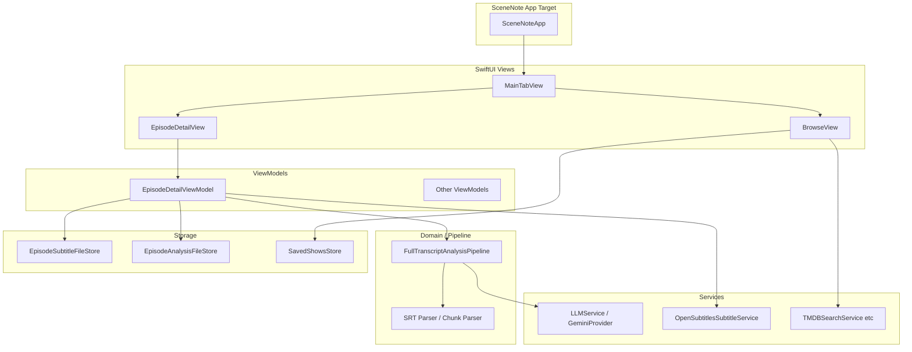

# An iOS App Built with Cursor: SceneNote Through a Data Engineer’s Lens

> "If one subtitle file is study material, the app’s job is to run that pipeline reliably."

**SceneNote** is an iOS app that pulls **English SRT subtitles** for TV and film, runs **Gemini** over the **full script** to extract **phrases** and **vocabulary**, and lets you move between **shows, expressions, words, study, and settings**. I work as a **data engineer** day to day—pipelines, schemas, and incident response are familiar; mobile was not. I used **Cursor** as a pair for design, implementation, and debugging. This post tells that story in **data-engineering terms** (pipeline, boundaries, sources and sinks, quality) and weaves in **today’s code** and **what we actually typed in chat**.

Repository: [https://github.com/data-droid/sceneNote](https://github.com/data-droid/sceneNote)

---

## Table of Contents {#toc}

- [What SceneNote Does](#what-is-scenenote)
- [App Structure at a Glance](#app-structure)
- [Architecture - SubtitleCore and the App Shell](#architecture)
- [Building It Together with Cursor](#building-together)
- [What Helped When Working with Cursor](#cursor-tips)
- [Conclusion](#conclusion)

---

## What SceneNote Does {#what-is-scenenote}

1. **Browse**: Save shows from TMDB search, open seasons and episodes, download subtitles from **OpenSubtitles**.
2. **Episode detail**: Load local SRT and run **full-script analysis** (one or a few LLM calls, JSON results).
3. **Expressions / Words**: Library-style browsing and detail (meaning, example, CEFR-style level).
4. **Study**: Review saved items.
5. **Settings**: Gemini API key, OpenSubtitles options, etc.

In one line: **subtitle file → preprocess → LLM → parse & merge → local persistence → UI**.

---

## App Structure at a Glance {#app-structure}

Five tabs from `MainTabView`:

| Tab | Role |
|-----|------|
| Shows (`BrowseView`) | Library, search, TMDB |
| Expressions (`ExpressionListView`) | Analyzed phrases |
| Words (`WordListView`) | Analyzed vocabulary |
| Study (`StudyView`) | Review |
| Settings (`SettingsView`) | API keys and services |

**Remote**: TMDB, OpenSubtitles, Gemini. **Local**: subtitle files, per-episode analysis snapshots, saved shows — file and UserDefaults stores.

**Stack**: SwiftUI, iOS 17+, SPM library `SubtitleCore` + tests, thin Xcode app target `SceneNote` with `@main` → `MainTabView()`.

---

## Architecture - SubtitleCore and the App Shell {#architecture}

Roughly MVVM. Dependency flow:



**Full-script analysis** lives in `FullTranscriptAnalysisPipeline`: **one request** when the script fits, otherwise **chunked sequential calls** with normalized-key merge. `singleShotCharacterLimit`, `maxChunkCharacters`, and `maxChunksPerRun` bound tokens, cost, and latency; `scriptTruncated` surfaces truncation in the UI.

---

## Building It Together with Cursor {#building-together}

### 1. Starting point - don’t build everything at once

The first message to Cursor sketched the big picture but insisted on **incremental** work—SwiftUI, MVVM, async/await, modularity—including this line:

> **Do NOT implement everything at once. Wait for my step-by-step instructions.**

A later one-line roadmap in chat looked like:

> Parser → n-gram → LLM 구조 → Gemini → Settings → Pipeline → UI → Local LLM

The shipped code shifted weight from n-grams toward **full-script LLM analysis**, but the habit of **small, stackable steps** stayed the same.

### 2. SRT parser and tests - spell out I/O and edge cases

The parser request was a classic bullet list:

> Implement a robust SRT subtitle parser in Swift. … Remove index numbers and timestamps, merge multiline subtitles… Handle edge cases (empty lines, malformed SRT). Write clean, testable code.

That was followed by unit tests, then n-gram quality tweaks (filtering low-meaning phrases like “I don’t”, “you know”), and iterative polish.

### 3. LLM and JSON - when the model won’t behave

After wiring `LLMProvider` and `GeminiProvider`, parsing broke often. The follow-up prompt was:

> Ensure the Gemini response strictly parses JSON. If needed, extract JSON safely from text response.

Today’s `ExpressionJSONParser.extractJSONPayload` and `TranscriptChunkAnalysisParser` **key aliases** (`expressions` / `phrases`, `phrase` / `expression` / `term`, etc.) are the hardened outcome of that thread.

### 4. Long scripts, timeouts, noisy cues

Long episodes don’t fit one shot; big prompts hit `URLSession` timeouts. We set **numeric limits** with Cursor for the pipeline, and `GeminiProvider` uses a **prompt-length-scaled timeout** with a ceiling.

Noisy one-line cues (“Hi”, “Thanks”) are stripped by `SubtitleTrivialCueFilter` as a **dedicated preprocessing layer**. Asking for **pure functions + tests** lined up well with `SubtitleCoreTests`.

### 5. New subtitle file, new analysis

Re-downloading subtitles changes the file, so stale analysis is wrong. `EpisodeDetailViewModel` calls `clearAnalysisBecauseSubtitleChanged()` after a successful save—something we refined with language like “only on successful save, not mixed with load failures.”

OpenSubtitles assumes TMDB linkage, so `refreshSubtitleStatus()` splits **guidance copy** from raw errors. Later, Browse-focused prompts (search more titles, **free** API options) pushed the TMDB direction further.

### 6. Compiler errors - paste verbatim

The fastest loop was pasting Swift diagnostics as-is, for example:

```
Cannot assign to property: 'settingsStore' is a 'let' constant
```

```
Call to main actor-isolated initializer 'init(pipeline:settingsStore:)'
in a synchronous nonisolated context
```

```
'.600' is not a valid floating point literal; it must be written '0.600'
```

Even **file path + one error line** was enough for Cursor to target `let` vs `var`, `@MainActor`, or literal syntax.

### 7. Xcode and SPM - when the app won’t launch

The same chat log has plain questions:

> How do I run the app in Xcode?  
> Rebuild still doesn’t start the app.

Alongside `No such module 'SubtitleCore'` / `Missing package product 'SubtitleCore'`, we asked Cursor to **unblock SPM ↔ app target wiring**. The repo shows the end state; a lot of wall-clock time lived in these messages.

---

## What Helped When Working with Cursor {#cursor-tips}

1. **Repro as user steps**: “Save show → episode → download → analyze” narrows view model bugs fast.
2. **Paste logs whole**: One Swift error block or a slice of Gemini HTTP cuts guesswork.
3. **One axis per change**: Keep pipeline changes separate from UI copy—smaller diffs, easier rollback.
4. **Protocols first**: Boundaries like `EpisodeSubtitleStoring`, `OpenSubtitlesSubtitleFetching` enable tests and mocks.

---

## Conclusion {#conclusion}

SceneNote keeps **subtitle → LLM → local library** inside **`SubtitleCore`** and the app target thin. The Cursor thread mixed **stepwise delivery**, **defensive JSON**, **long scripts and timeouts**, **data consistency**, and **SPM/Xcode wiring**—the quotes above are just a sample.

Agents write code quickly; **what “correct” means** is still the developer’s job. Next I want retries/rate limits, offline behavior, and backup (`SceneNoteDataBackup`, etc.) so it becomes a **daily driver**.

---

*Repository: [github.com/data-droid/sceneNote](https://github.com/data-droid/sceneNote)*
