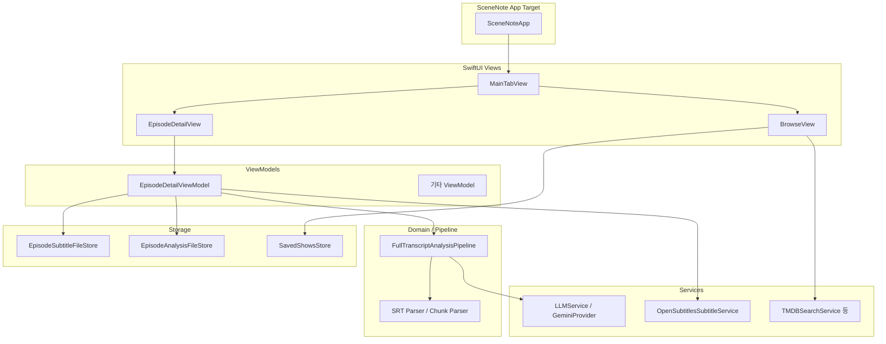

# Cursor로 만든 iOS 앱, 데이터 엔지니어의 시선으로 풀어본 SceneNote 개발기

> "자막 한 편이 곧 학습 재료가 된다면, 앱은 그 파이프라인을 안정적으로 돌려주는 도구다."

**SceneNote**는 TV 드라마·영화 **자막(SRT)** 을 가져와 **Gemini**로 전체 대본을 분석해 **표현**과 **어휘**를 뽑고, 탭으로 **작품·표현·단어·학습·설정**을 오가며 복습하는 iOS 앱입니다. 저는 평소 **데이터 엔지니어**로 일하며 파이프라인·스키마·장애 대응에 익숙한데, 모바일은 낯선 영역이었습니다. 그래서 **Cursor**와 짝을 이뤄 설계·구현·디버깅을 진행했고, 이 글에서는 그 과정을 **데이터 쪽에서 쓰는 말**(파이프라인, 경계, 소스·싱크, 품질)로 짚어 보고, **지금 코드**와 **당시 채팅에 쓴 말**을 한 줄기로 묶었습니다.

소스: [https://github.com/data-droid/sceneNote](https://github.com/data-droid/sceneNote)

---

## 📚 목차 {#toc}

- [SceneNote가 하는 일](#what-is-scenenote)
- [앱 구조 한눈에 보기](#app-structure)
- [아키텍처 - SubtitleCore와 씬 앱](#architecture)
- [Cursor와 함께 만들어가며](#building-together)
- [함께 일할 때 유용했던 것](#cursor-tips)
- [마무리](#conclusion)

---

## SceneNote가 하는 일 {#what-is-scenenote}

1. **작품(Browse)**: TMDB 검색으로 드라마·영화를 저장하고, 시즌·에피소드까지 탐색합니다. OpenSubtitles에서 **영어 자막**을 내려받을 수 있습니다.
2. **에피소드 상세**: 로컬 SRT를 읽어 **전체 대본 분석**을 실행합니다. LLM이 한 번 또는 몇 번에 나누어 표현·단어 목록을 JSON으로 돌려줍니다.
3. **표현 / 단어**: 분석 결과를 라이브러리처럼 보고, 상세에서 의미·예문·CEFR 수준 등을 봅니다.
4. **학습**: 저장된 항목으로 복습합니다.
5. **설정**: Gemini API 키, OpenSubtitles 설정 등을 둡니다.

한 줄로 말하면 **자막 파일 → 전처리 → LLM → 파싱·병합 → 로컬 저장 → UI** 입니다.

---

## 앱 구조 한눈에 보기 {#app-structure}

`MainTabView` 기준 다섯 탭입니다.

| 탭 | 역할 |
|----|------|
| 작품 (`BrowseView`) | 저장·검색, TMDB 연동 |
| 표현 (`ExpressionListView`) | 분석된 표현 |
| 단어 (`WordListView`) | 분석된 어휘 |
| 학습 (`StudyView`) | 복습 |
| 설정 (`SettingsView`) | API 키·외부 서비스 |

**원격**은 TMDB, OpenSubtitles, Gemini. **로컬**은 자막 파일·에피소드별 분석 스냅샷·저장 작품 등을 파일·UserDefaults 스토어로 둡니다.

**스택**: SwiftUI, iOS 17+, SPM 라이브러리 `SubtitleCore` + 테스트, Xcode 앱 타깃 `SceneNote`는 `@main`에서 `MainTabView()`만 감싼 얇은 셸입니다.

---

## 아키텍처 - SubtitleCore와 씬 앱 {#architecture}

MVVM에 가깝게 흩어져 있고, 의존 방향만 요약하면 아래와 같습니다.



**전체 대본 분석**은 `FullTranscriptAnalysisPipeline`이 맡습니다. 대본이 짧으면 **한 번의 요청**, 길면 **청크로 나눠 순차 호출**하고, 정규화된 키로 표현·어휘를 병합합니다. `singleShotCharacterLimit`, `maxChunkCharacters`, `maxChunksPerRun`으로 토큰·비용·타임아웃을 통제하고, 잘린 경우 `scriptTruncated`를 UI에 남깁니다.

---

## Cursor와 함께 만들어가며 {#building-together}

### 1. 출발점 - 한 번에 다 짓지 않기

맨 처음 Cursor에게는 큰 그림만 주고, **한 번에 전부 구현하지 말라**고 못을 박았습니다. SwiftUI·MVVM·async/await·모듈화를 요구하면서, 영어로 이렇게 적어 두었습니다.

> **Do NOT implement everything at once. Wait for my step-by-step instructions.**

그다음 순서는 대화 속에서 굳어졌습니다. 한 줄로 다시 정리한 메시지도 있었습니다.

> Parser → n-gram → LLM 구조 → Gemini → Settings → Pipeline → UI → Local LLM

실제 코드는 n-gram 중심에서 **전체 대본 LLM 분석** 쪽으로 무게가 옮겨졌지만, “작은 단위로 쌓는다”는 방식은 끝까지 통했습니다.

### 2. SRT 파서와 테스트 - 요구사항을 그대로 적어 주기

SRT 파서는 입력·출력·엣지 케이스를 bullet로 적는 전형적인 요청이었습니다.

> Implement a robust SRT subtitle parser in Swift. … Remove index numbers and timestamps, merge multiline subtitles… Handle edge cases (empty lines, malformed SRT). Write clean, testable code.

이어서 단위 테스트 추가, n-gram 품질 개선(“i don’t”, “you know” 같은 저의미 구문 걸러내기) 같은 메시지로 Cursor가 제안한 구현을 다듬었습니다.

### 3. LLM과 JSON - 모델 응답을 믿을 수 없을 때

`LLMProvider`와 `GeminiProvider`를 붙인 뒤에는 파싱이 자주 깨졌습니다. 그때 던진 문장이 이것입니다.

> Ensure the Gemini response strictly parses JSON. If needed, extract JSON safely from text response.

지금 코드의 `ExpressionJSONParser.extractJSONPayload`, `TranscriptChunkAnalysisParser`의 **여러 키 별칭**(`expressions` / `phrases`, `phrase` / `expression` / `term` 등)은 그 대화에서 나온 방어 로직이 그대로 굳은 부분입니다.

### 4. 긴 대본, 타임아웃, 노이즈 큐

에피소드가 길어지면 한 번에 넣기 어렵고, 프롬프트가 커질수록 `URLSession` 타임아웃에 걸립니다. Cursor와는 **숫자 제한**을 명시해서 파이프라인을 잡았고, `GeminiProvider`에는 프롬프트 길이에 비례하는 타임아웃(상한 포함)을 두었습니다.

SRT를 그대로 넣으면 "Hi", "Thanks" 같은 큐만 잔뜩 들어가는 문제는 `SubtitleTrivialCueFilter`로 **전처리 계층**을 분리해 해결했습니다. “순수 함수로 빼고 테스트에 엣지 케이스 넣자”는 식으로 요청하면 `SubtitleCoreTests`와 잘 맞물렸습니다.

### 5. 자막을 바꾸면 분석은 무효

자막을 재다운로드하면 파일 내용이 바뀌므로, 옛 분석을 남기면 안 됩니다. `EpisodeDetailViewModel`에서 저장 직후 `clearAnalysisBecauseSubtitleChanged()`로 스냅샷과 UI 상태를 비우는 흐름은 “**저장 성공 시에만** 지우고, 로드 실패와 섞지 말자”는 식으로 Cursor와 맞춘 동작입니다.

OpenSubtitles는 TMDB ID 전제가 있어서, `refreshSubtitleStatus()`로 **안내 문구**를 나눈 것도 같은 맥락입니다. 나중에는 Browse에서 다른 작품을 검색하고 **무료로 쓸 수 있는 방법**을 묻는 메시지로 TMDB 방향이 더 분명해졌습니다.

### 6. 컴파일 에러는 복사해서 붙여넣기

Swift가 준 메시지를 그대로 채팅에 올리면 가장 빨랐습니다. 실제로 이런 줄들이 대화에 있었습니다.

```
Cannot assign to property: 'settingsStore' is a 'let' constant
```

```
Call to main actor-isolated initializer 'init(pipeline:settingsStore:)'
in a synchronous nonisolated context
```

```
'.600' is not a valid floating point literal; it must be written '0.600'
```

파일 경로와 한 줄만 있어도 Cursor가 `let`/`var`, `@MainActor`, 리터럴 문법까지 바로 짚어 주었습니다.

### 7. Xcode와 SPM - 앱이 안 뜰 때

같은 트랜스크립트에는 실행 환경 질문도 그대로 남아 있습니다.

> xcode에서 앱띄우려면 어떻게해?  
> 흠 뭔지 모르겠지만 재빌드해도 앱이 시작을 안하내

`No such module 'SubtitleCore'`, `Missing package product 'SubtitleCore'` 같은 메시지와 함께 **패키지 제품과 iOS 앱 타깃 연결**을 Cursor에게 풀어달라고 한 적도 있습니다. 코드만 보면 “연결되어 있다”는 결과만 보이지만, 실제 시간은 이런 구간에서 많이 썼습니다.

---

## 함께 일할 때 유용했던 것 {#cursor-tips}

1. **사용자 동선으로 재현**: "작품 저장 → 에피소드 → 다운로드 → 분석"처럼 순서를 적어 주면 뷰모델 버그가 빨리 좁혀집니다.
2. **컴파일러·네트워크 로그 그대로**: Swift 에러 한 블록, Gemini HTTP 일부를 붙이면 추측이 줄어듭니다.
3. **한 번에 한 축**: 파이프라인과 UI 문구를 한 PR에 안 섞으면 롤백이 쉽습니다.
4. **프로토콜부터**: `EpisodeSubtitleStoring`, `OpenSubtitlesSubtitleFetching`처럼 경계를 먼저 잡고 구현을 채웁니다.

---

## 마무리 {#conclusion}

SceneNote는 **자막 → LLM → 로컬 라이브러리**를 `SubtitleCore` 한 패키지에 모으고, 앱 타깃은 가볍게 유지한 형태로 자리 잡았습니다. Cursor와의 대화에는 **단계적 구현**, **JSON 방어**, **긴 대본·타임아웃**, **데이터 일관성**, **SPM·Xcode 연결**이 고르게 섞여 있고, 위 인용들은 그중 일부입니다.

에이전트는 코드를 빨리 써 주지만, **무엇이 맞는 상태인지**는 여전히 개발자가 정합니다. 다음으로는 재시도·레이트 리밋, 오프라인, 백업(`SceneNoteDataBackup` 등)을 다듬어 매일 쓰는 앱으로 굳히고 싶습니다.

---

*저장소: [github.com/data-droid/sceneNote](https://github.com/data-droid/sceneNote)*
